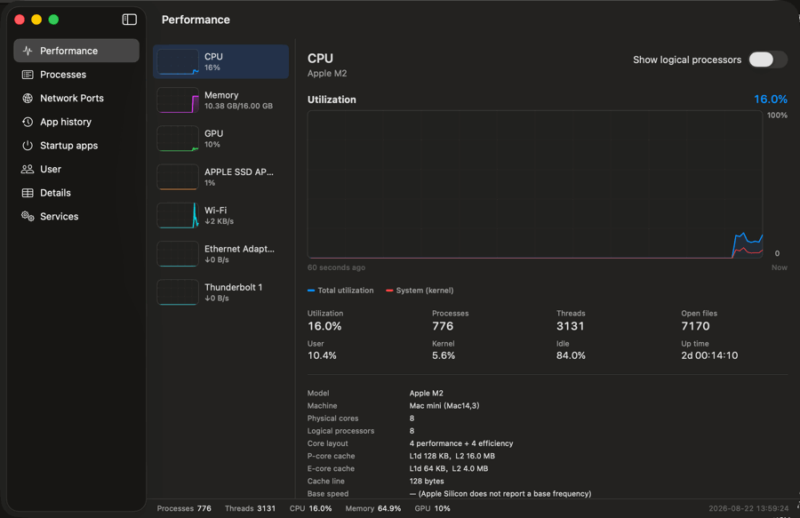
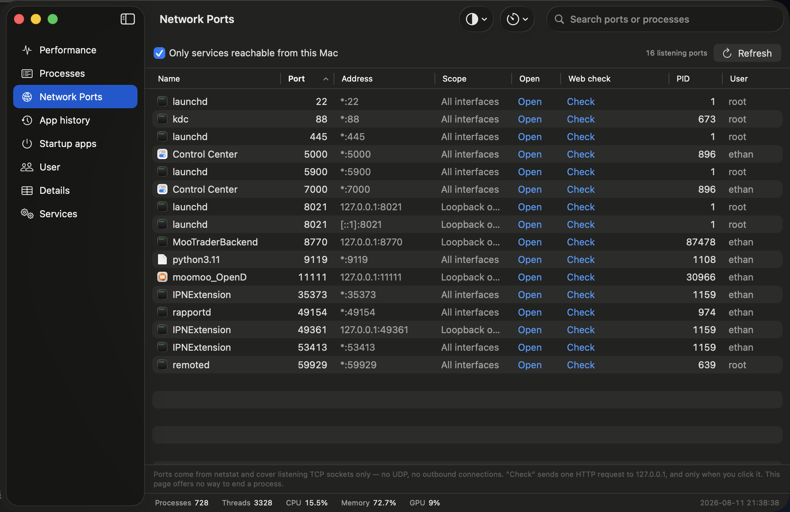
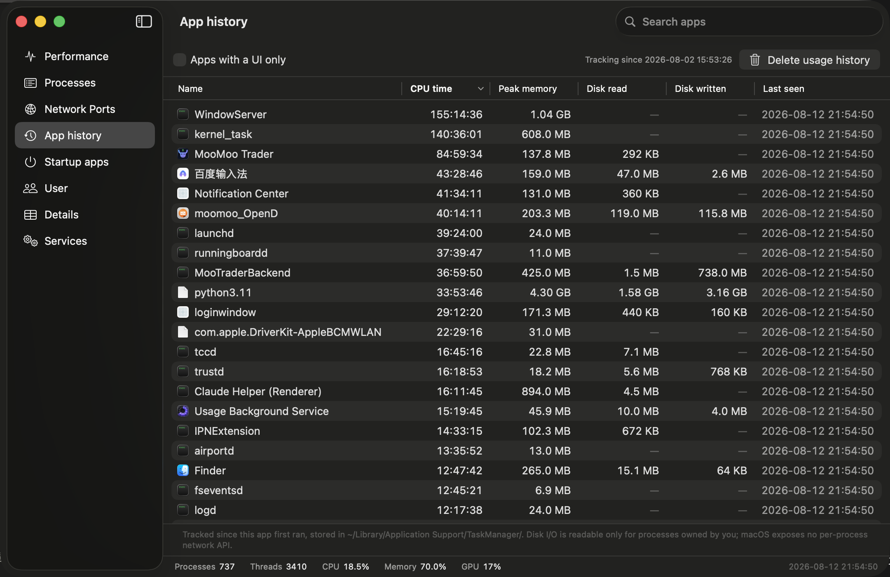
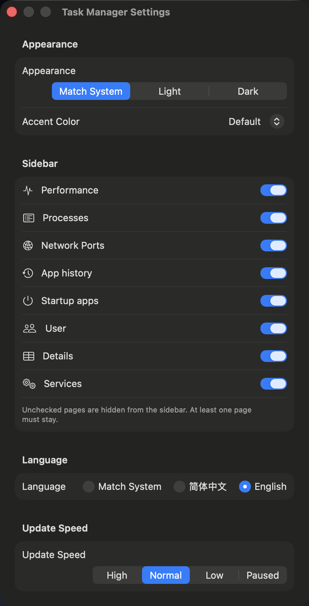

# Task Manager for macOS

A **Windows 11 Task Manager**–style system monitor for macOS. One window that answers what is
running, what is eating your CPU, where your memory went, what the GPU is doing — and lets you
end whatever is hanging.

Free, open source, and it asks for **no password and no system permissions**.

[English](README.md) · [简体中文](README.zh-CN.md)


[](https://github.com/ethan6945/macos-task-manager/releases/latest)
[](https://buymeacoffee.com/ethan6945)



---

## Download

Get the latest `.dmg` from [**Releases**](https://github.com/ethan6945/macos-task-manager/releases/latest),
open it, and drag **Task Manager** into Applications.

**Requirements:** macOS 14 Sonoma or later, Apple Silicon or Intel.

### The first launch will be blocked — this is normal

This app is not notarized by Apple (notarization requires a paid Developer ID). macOS will refuse
the first launch and may even say the app "is damaged". It is not. Do this **once**:

**System Settings → Privacy & Security →** scroll to the bottom **→ Open Anyway →** confirm.

Or run this in Terminal instead:

```bash
xattr -dr com.apple.quarantine "/Applications/Task Manager.app"
```

> On macOS 15 Sequoia and later, the old "Control-click → Open" trick no longer works for
> un-notarized apps.

Rather not run a downloaded binary? [Build it yourself](#build-from-source) — about a minute,
no Xcode needed.

---

## Features

### Performance

Five sub-pages, each with a live 60-second graph.

- **CPU** — utilization, or a per-logical-processor grid that tells **performance cores apart from
  efficiency cores**. Process, thread and open-file counts, uptime, chip model, core layout and
  cache sizes.
- **Memory** — a **composition bar** showing exactly where your RAM went: app memory, wired,
  compressed and cached files. Plus a memory-pressure graph, swap usage, page-in/out counters,
  and your RAM type and vendor.
- **GPU** — utilization, the **Renderer and Tiler engines** graphed separately, VRAM allocated
  and in use, GPU core count. Activity Monitor has no GPU page at all.
- **Disk** — active time, read/write throughput, IOPS, average response time, and capacity per volume.
- **Network** — per-interface send/receive graphs, totals, link speed, IPv4 / IPv6 / MAC.

### Processes

Every process on one screen, split into **Apps** and **Background processes**, with CPU, memory,
disk, threads, energy, PID and user. Sort by any column, search by name or PID, and **End task**
or **Force quit** from the toolbar or the right-click menu.

### Network ports

Every TCP port listening on this Mac and the process holding it — the page for finding the
**local services running in the background**. Addresses like `http://127.0.0.1:8770` open in your
browser with one click, and you can **check whether a port actually serves HTTP** on demand (one
request, sent only when you click Check — nothing is ever scanned automatically). Ports reachable
from this Mac are shown by default. No UDP, no outbound connections.

### Details

The same list with 16 columns for when you need the real numbers: status, architecture, parent
PID, priority, CPU time, ports, page-ins, context switches, start time and full path. Select a
process to see its command line, and right-click to **set its priority**.

### Startup apps

Everything launchd starts at boot or login, with its load state, whether it runs at load and
whether it is kept alive. Items in your own `~/Library/LaunchAgents` can be enabled or disabled.

### Services

launchd jobs in your user session — label, PID and last exit status. Jump straight from a running
service to its process in Details.

### Users

Login sessions with per-user CPU, memory and process totals, expandable to that user's processes.

### App history

Cumulative CPU time, peak memory and disk I/O per app, tracked from the first time you run
Task Manager.


<details>
<summary><b>Screenshots of every page</b></summary>

| | |
|---|---|
| **Performance › CPU** |  |
| **Processes** |  |
| **Network ports** |  |
| **Performance › Memory** |  |
| **Performance › GPU** |  |
| **Performance › Disk** |  |
| **Performance › Network** |  |
| **Details** |  |
| **Startup apps** |  |
| **Services** |  |
| **User** |  |
| **App history** |  |
| **Settings** |  |

</details>

---

## Using it

| | |
|---|---|
| **Update speed** | High (1s) · Normal (2s) · Low (4s) · Paused — **Settings › Update Speed** |
| **Appearance** | Light, dark or match system, plus 8 accent colours — **Settings › Appearance** |
| **Language** | English or 简体中文, **switches instantly without restarting** |
| **Sidebar** | Hide the pages you never use — **Settings › Sidebar** |
| **Save a snapshot** | **⇧⌘S** saves the window as a PNG |
| **Always on top** | View menu |
| **Settings** | **⌘,** |

---

## What macOS will not let it do

These are labelled in the app rather than faked:

- **Per-process network traffic and per-process GPU usage** — macOS has no public API for either.
  System-wide GPU usage is available and shown.
- **Disk I/O and command line for other users' processes** — readable only for your own processes.
- **CPU base frequency on Apple Silicon** — not reported by the system.
- **Ending another user's or a system process** — the app does not ask for admin rights, so these
  return a permission error with a clear message.

It reads everything through public system APIs. There is no background helper, no privileged
service and no permission prompt — which is also why it never asks for your password.

---

## Build from source

Xcode is not required, only Command Line Tools and Swift 6:

```bash
git clone https://github.com/ethan6945/macos-task-manager.git
cd macos-task-manager
make run
```

`make build` produces `build/Task Manager.app` · `make dmg` produces an installer ·
`make stop` quits a running copy.

---

## Support

This is a free, MIT-licensed side project. If it saved you some time you can
[**buy me a coffee**](https://buymeacoffee.com/ethan6945) — completely optional, and the app will
always stay free.

<a href="https://buymeacoffee.com/ethan6945"></a>

Starring the repo helps just as much — that is how other people find it.

## Contributing

Issues and pull requests are welcome. For a UI problem, **⇧⌘S** gives you a clean screenshot to attach.

## License

[MIT](LICENSE) · A tribute to [Dave Plummer](https://www.youtube.com/@DavesGarage), who wrote the
original `taskmgr.exe` for Windows NT 4.0 and Windows 2000.
