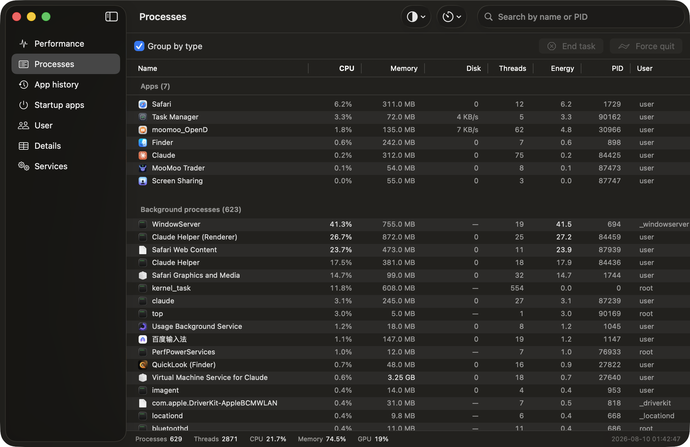
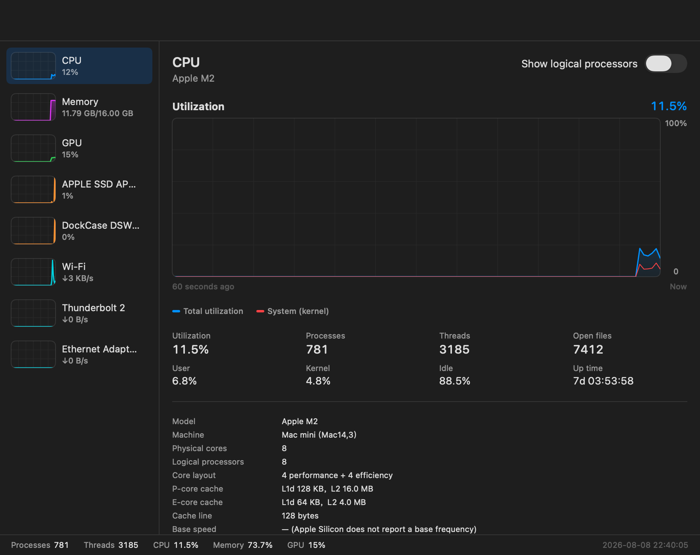
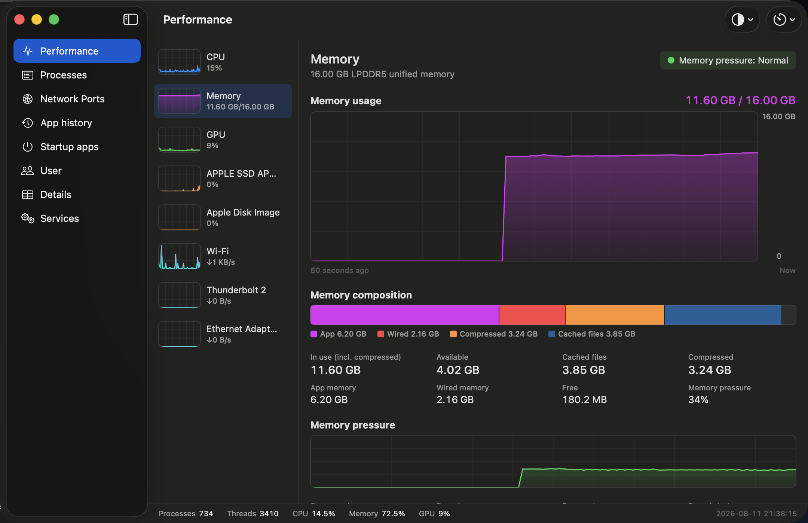
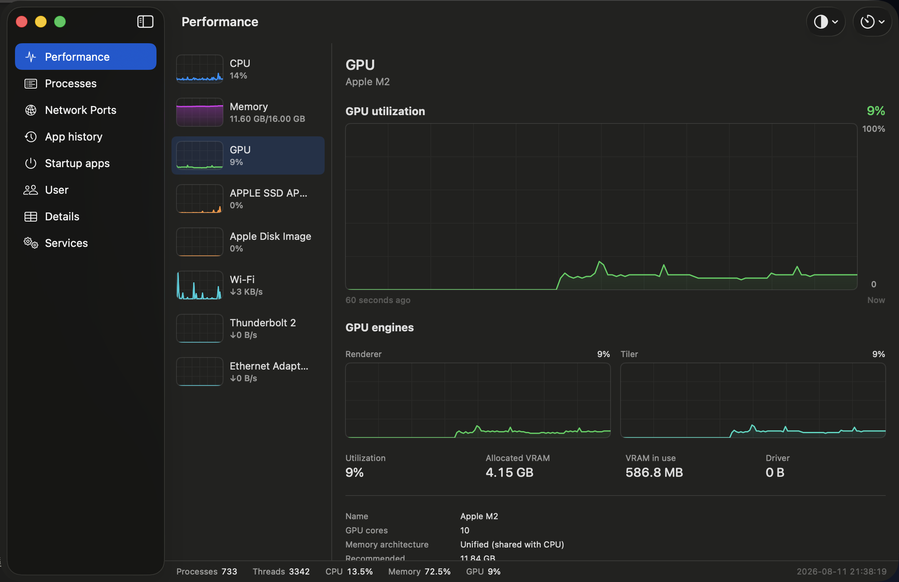
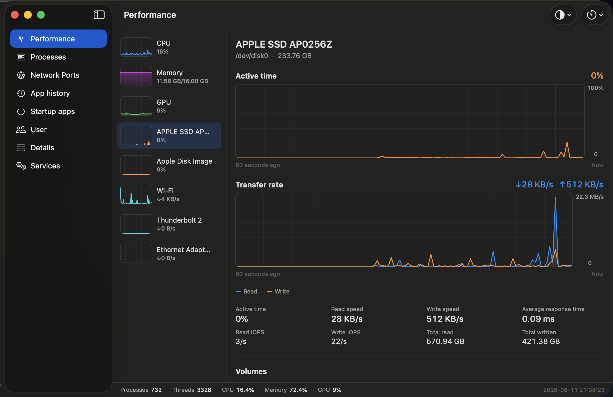
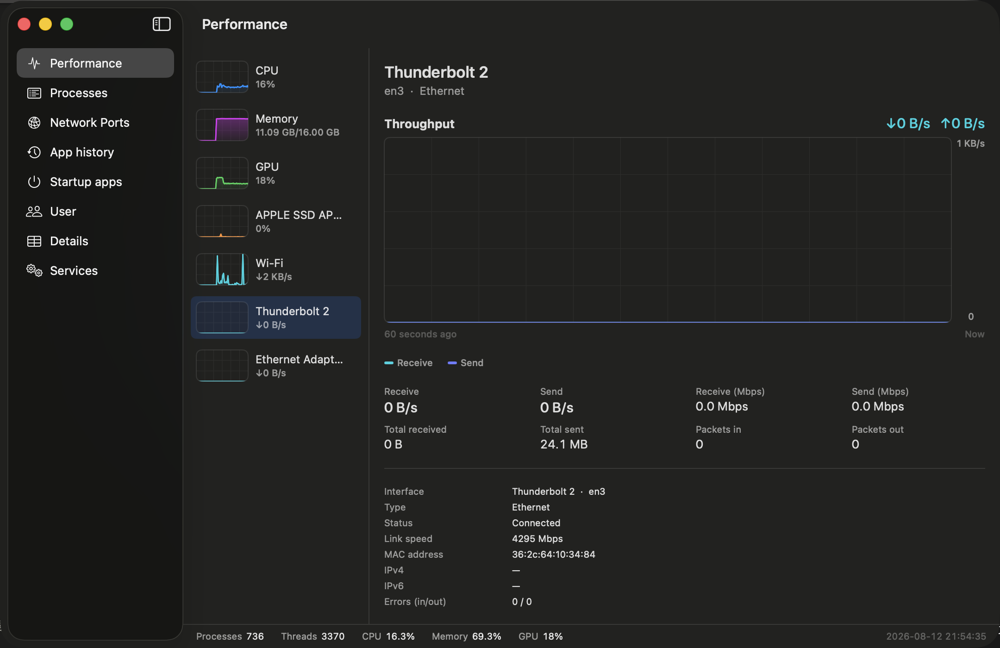
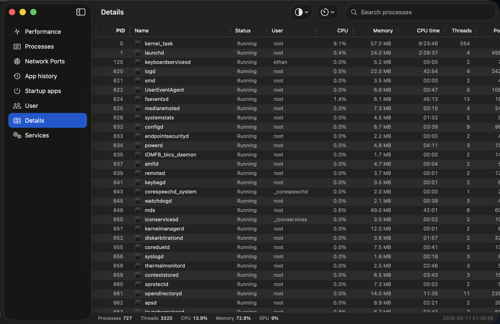
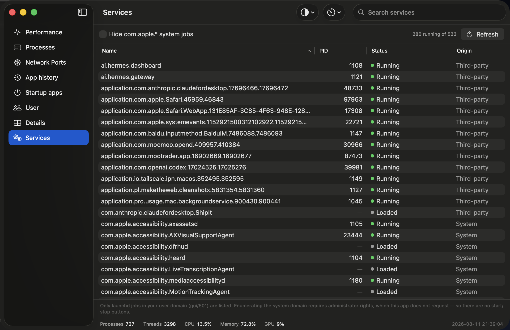
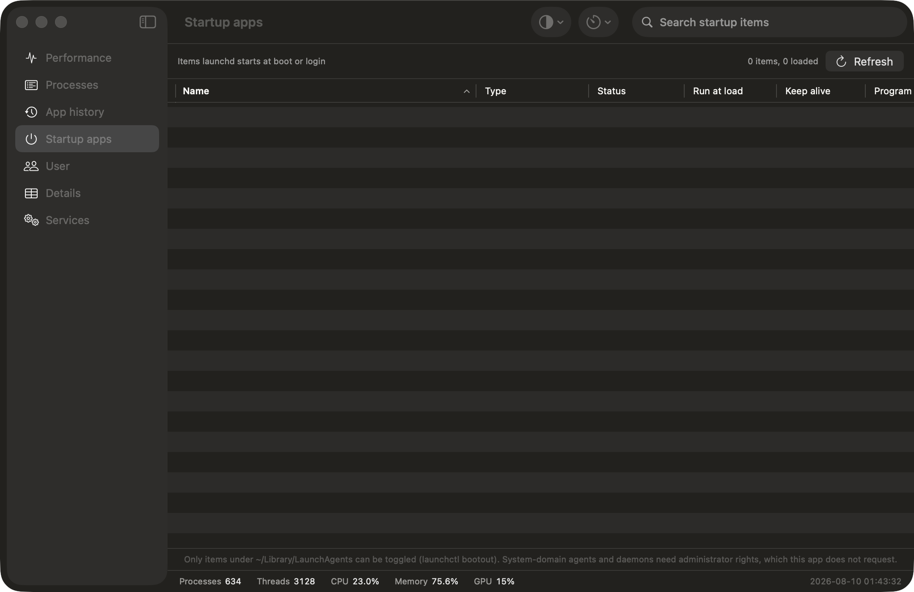
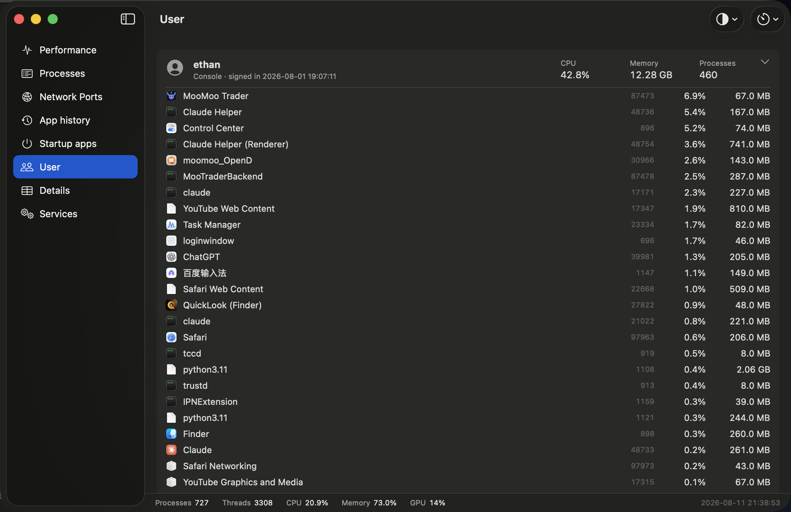

# macOS 版任务管理器

对标 **Windows 11 任务管理器**的 macOS 系统监视器，SwiftUI + AppKit 写的。
七个页面、性能页五个子页，**CPU / 内存 / GPU / 磁盘 / 网络**全覆盖 ——
**不装特权 helper、不要 sudo、不弹任何权限申请**。

致敬 [Dave Plummer](https://www.youtube.com/@DavesGarage)：Windows NT 4.0 / 2000 的
`taskmgr.exe` 就是他写的。

[English](README.md) · [简体中文](README.zh-CN.md)


[](https://github.com/ethan6945/macos-task-manager/releases/latest)
[](https://buymeacoffee.com/ethan6945)



<details>
<summary><b>更多截图</b></summary>

### 性能 › CPU


### 性能 › 内存


### 性能 › GPU


### 性能 › 磁盘


### 性能 › 网络


### 详细信息


### 服务


### 启动应用


### 用户


</details>

## 下载

去 [**Releases**](https://github.com/ethan6945/macos-task-manager/releases/latest) 下最新的 `.dmg`，
打开后把 **Task Manager** 拖进「应用程序」。

### ⚠️ 第一次打开一定会被拦，这是正常的

这个 App **没有经过 Apple 公证**（公证需要 $99/年的 Apple Developer ID）。
macOS 会拒绝第一次启动，甚至说它「已损坏」。它没有损坏。二选一，只需做一次：

**方式 A —— 系统设置**

1. 先双击一次（会被拒绝）。
2. 打开**系统设置 → 隐私与安全性**。
3. 拉到底，点 *Task Manager* 旁边的**仍要打开**，确认。

**方式 B —— 终端一行**

```bash
xattr -dr com.apple.quarantine "/Applications/Task Manager.app"
```

> macOS 15 Sequoia 之后，老办法「右键 → 打开」对未公证的 App 已经失效，只能用上面两种。

不想信任网上下的二进制的话，直接从源码编译，一分钟的事，也不需要 Xcode。

### 运行要求

macOS 14 或更新；Apple Silicon / Intel 都行。**不需要**管理员密码、完全磁盘访问、屏幕录制或任何辅助工具。

## 页面

| 页面 | 内容 |
|---|---|
| **进程** | 应用 / 后台进程分组，名称·CPU·内存·磁盘·线程·能耗·PID·用户，可排序可搜索；结束进程（SIGTERM）与强制结束（SIGKILL） |
| **性能 › CPU** | 总利用率大图 + 每逻辑处理器小图（区分性能核/能效核），进程数、线程数、打开文件数、开机时长、型号与各级缓存 |
| **性能 › 内存** | 使用量曲线 + 内存构成条（App / 联动 / 已压缩 / 已缓存文件）、内存压力曲线、交换区、换页统计、内存类型与制造商 |
| **性能 › GPU** | 利用率大图 + 渲染器与分块器两个「GPU 引擎」分图、显存占用、GPU 核心数、统一内存 |
| **性能 › 磁盘** | 活动时间、读写速率、IOPS、平均响应时间、各卷容量 |
| **性能 › 网络** | 每网卡双向吞吐曲线、累计收发、链路速度、IPv4/IPv6/MAC |
| **应用历史记录** | 按应用累计的 CPU 时间、峰值内存、磁盘读写（本程序自行记账并持久化） |
| **启动应用** | LaunchAgents / LaunchDaemons，含加载状态与「登录时启动」「保持运行」 |
| **用户** | utmpx 登录会话 + 按用户聚合的资源占用，可展开看该用户的进程 |
| **详细信息** | 16 列硬核进程表 + 命令行、设置优先级（nice） |
| **服务** | 用户域 launchd 作业（Label / PID / 上次退出码），可跳转到详细信息 |

底部常驻状态栏（进程 / 线程 / CPU / 内存 / GPU）致敬原版 taskmgr。
刷新速率：高 1s / 正常 2s / 低 4s / 暂停。

## 隐私模式

**查看 → 隐私模式**（设置面板里也有），分享截图或录屏前把能指向你个人的信息挡掉：

- 登录用户名（uid ≥ 500）显示成 `user`
- 主机名显示成 `mac`
- 服务页与启动项页只列 `com.apple.*` 的系统作业，第三方启动项不外泄

进程名**故意不遮** —— 那是这个 App 的核心内容，遮了就没意义了。不想露出来的 App，截图前退掉即可。

本 README 里的截图都是开着隐私模式拍的。

## 外观与语言

**⌘,** 打开设置，或用工具栏最右侧的外观菜单，也可以从「查看」菜单里改：

- **外观**：跟随系统 / 浅色 / 深色 —— 直接作用到 `NSApp.appearance`，全窗口即时生效。
- **强调色**：默认（跟随系统）或 8 种预设色。
- **语言**：跟随系统 / 简体中文 / English —— **切换即生效，不用重启**。

语言实现在 [Localization.swift](Sources/TaskManager/Model/Localization.swift)：用中文原文当 key、
英文查表。这样既不用发明一套 key 名，也能在运行时切换（`.lproj` 资源包换语言必须重启进程）。
`L()` 是在 view body 里调用的，它读到 `Localizer.language` 就自动建立了 SwiftUI 观察依赖，
切换后界面自己重画；NSTableView 的列标题在 `updateNSView` 里同步。

## 窗口快照

**⇧⌘S** 把当前窗口存成 PNG。走的是 `CALayer.render(in:)` —— 在自己的进程里画自己的视图，
**不需要「屏幕录制」权限**。设了环境变量 `TM_CAPTURE_DIR` 时会自动逐页截图然后退出，
用于自动化验证：

```bash
TM_CAPTURE_DIR=/tmp/shots "build/Task Manager.app/Contents/MacOS/Task Manager"
```

一个已知限制：左侧导航栏用的是毛玻璃材质（behind-window blending），由窗口服务器合成，
离屏渲染拿不到，快照里会是一块空白。窗口里其他内容都是完整的。

## 图标

`Resources/AppIcon.icns` 是脚本画出来的，不是图片资源：[MakeIcon.swift](Scripts/MakeIcon.swift)
用 CoreGraphics 按矢量在 10 个尺寸上分别重绘（16…1024），小尺寸下自动简化细节
（引脚从 3 根减到 2 根、波形只留大起伏），所以 16px 时也不会糊。

当前方案是 **chip**：处理器晶粒 + 四边引脚 + 中间一条绿色活动脉冲。脚本里还有另外三个
方案可选，`ICON_STYLE` 切换：

| 方案 | 样子 |
|---|---|
| `chip` | 芯片 + 活动脉冲（默认） |
| `pulse` | 青色示波波形，带辉光 |
| `bars` | 蓝紫渐变的活动柱 |
| `gauge` | 绿→红弧形负载表 + 指针 |

```bash
make icon                   # 重新生成（默认 chip）
make icon ICON_STYLE=pulse  # 换方案
make icon-previews          # 四个方案各出一张预览图
```

`make build` 时若 `Resources/AppIcon.icns` 不存在会自动生成。

刻意避开了「绿色折线一路向上 + 面积填充」——那是股票走势图的视觉语法，
容易和行情类 App 混淆。

## 数据从哪来

| 数据 | 来源 |
|---|---|
| CPU 总体与每核 | `host_processor_info(PROCESSOR_CPU_LOAD_INFO)` tick 差分 |
| 内存 | `host_statistics64(HOST_VM_INFO64)` + `hw.memsize` + `vm.swapusage` + `kern.memorystatus_vm_pressure_level` |
| GPU | IORegistry `IOAccelerator` 节点的 `PerformanceStatistics`；设备规格来自 Metal |
| 磁盘 | IORegistry `IOBlockStorageDriver` 的 `Statistics` 差分；卷信息用 `getmntinfo` |
| 网络 | `getifaddrs` 的 `AF_LINK`（`if_data`）差分；接口显示名来自 SystemConfiguration |
| 进程身份 | `sysctl(KERN_PROC_ALL)` → pid/ppid/uid/状态/nice/启动时间；路径来自 `proc_pidpath` |
| 进程指标 | 常驻 `top -l 0` 子进程（见下）；磁盘 I/O 用 `proc_pid_rusage` |
| 服务 / 启动项 / 用户 | `launchctl list`、LaunchAgents/Daemons 的 plist、`utmpx` |

### 为什么要常驻一个 `top` 子进程

未签名的普通 App 调用 `proc_pidinfo(PROC_PIDTASKALLINFO)` 只能读到**同用户**的进程。
本机实测：691 个进程里 291 个（42%）读不到 CPU 与内存。`kinfo_proc` 里的
`e_vm` / `p_pctcpu` 字段在现代 macOS 上全是 0，也帮不上忙。

`/bin/ps` 和 `/usr/bin/top` 之所以能看到全部，是因为它们是 **setuid root** 且带
`com.apple.system-task-ports.read` 权限——这是需要 Apple 签发的受限权限，普通开发者拿不到。

所以这里常驻一个 `top -l 0` 子进程解析它的输出。效果：**全部 691 个进程都有完整指标**，
不需要任何提权或授权弹窗。子进程被杀掉会自动重启，App 退出时会被收掉。

## 性能

进程表用 **NSTableView**（`NSViewRepresentable`）而不是 SwiftUI 的 `Table`。原因是实测下来：

| 实现 | 691 进程、2 秒刷新时的 CPU |
|---|---|
| SwiftUI `Table` | 18–20%（与行数无关，是它替换数据的固定开销） |
| NSTableView，单元格用 Auto Layout | 34% |
| NSTableView，单元格手动布局 + 只重载可见行 | **12%** |

关键的三点：单元格**不用 Auto Layout**（几百条约束会让 `-[NSWindow layoutIfNeeded]`
吃掉三分之一的主线程时间）、用 `noteNumberOfRowsChanged` + 只重载可见行代替 `reloadData`
（后者会 purge 掉全部 row view）、排序不走 `KeyPathComparator`（按名称排 690 行要 20ms）。

性能页约 7%。选「低（4s）」可再减半。作为对照，活动监视器在默认 5 秒刷新下约 2%。

另外两个踩过的坑：分组标题换行号时必须整表 `reloadData`（row view 的「是不是分组行」是创建时
定下来的，只重载单元格会留下空白行）；`tableViewSelectionDidChange` 里不能直接写回 SwiftUI 状态，
那会同步触发 `updateNSView`，构成对 NSTableView 的重入调用。

## macOS 上做不到的几项

这些在界面上都有明确标注，不做假数据：

- **按进程的网络流量**：macOS 没有公开接口。系统自带的 `nettop` 走私有的
  NetworkStatistics.framework 且需要 root。
- **按进程的 GPU 占用**：同样没有公开接口，只能给出全局 GPU 利用率。
- **按进程的磁盘 I/O**：`proc_pid_rusage` 只对同用户的进程可读，其他进程显示「—」。
- **命令行**：`KERN_PROCARGS2` 只对同用户的进程可读。
- **CPU 基准频率**：Apple Silicon 不暴露 `hw.cpufrequency`。
- **系统域 launchd 作业**：枚举 `system/` 域需要 root，只列用户域（gui/uid）。
- **结束其他用户/系统的进程**：会返回 EPERM 并给出提示，本程序不提权
  （不使用已废弃的 `AuthorizationExecuteWithPrivileges`，也不装特权 helper）。
- **应用历史记录**：macOS 没有系统级的长期资源记账，数据从本程序首次运行起自行累计，
  存在 `~/Library/Application Support/TaskManager/app-history.json`。

## 代码结构

```
Sources/TaskManager/
  TaskManagerApp.swift          @main、菜单（刷新速率、窗口置顶）
  Model/
    SystemMonitor.swift         @MainActor @Observable，保存最新快照与历史曲线
    SamplingEngine.swift        actor，所有采集器都关在里面
    AppHistoryStore.swift       应用历史记账与持久化
    History.swift               图表用的定长环形缓冲
    Formatting.swift            字节/速率/时长格式化
  System/                       每个文件一个采集器，纯 C API
    CPUSampler / MemorySampler / GPUSampler / DiskSampler / NetworkSampler
    ProcessSampler / TopStream / ServiceSampler / StartupSampler / UserSampler
    SysctlKit / IORegistry / SystemInfo / Locked / CString
    Localization.swift          中英文案表与运行时切换
    Theme.swift                 外观（浅色/深色）与强调色
  Views/
    RootView.swift              NavigationSplitView 七页导航 + 状态栏
    SettingsView.swift          ⌘, 设置面板与工具栏外观菜单
    ProcessesView / DetailsView / AppHistoryView / StartupView / UsersView / ServicesView
    Performance/{PerformanceView,CPUView,MemoryView,GPUView,DiskView,NetworkView}
    Components/{ProcessTable,ProcessSorting,Graph,MetricGrid,IconCache,WindowSnapshot}
```

采样跑在 `SamplingEngine` actor 上，只把 `Sendable` 的值类型快照交回主线程。
整个工程在 Swift 6 严格并发模式下零警告编译。

## 请我喝杯咖啡

这是个免费的 MIT 开源小项目。如果它帮你省了点时间，可以
[**请我喝杯咖啡**](https://buymeacoffee.com/ethan6945) —— 纯自愿，这个 App 永远免费。

<a href="https://buymeacoffee.com/ethan6945"></a>

其实点个 star 一样有用 —— 那是别人能搜到它的原因。
